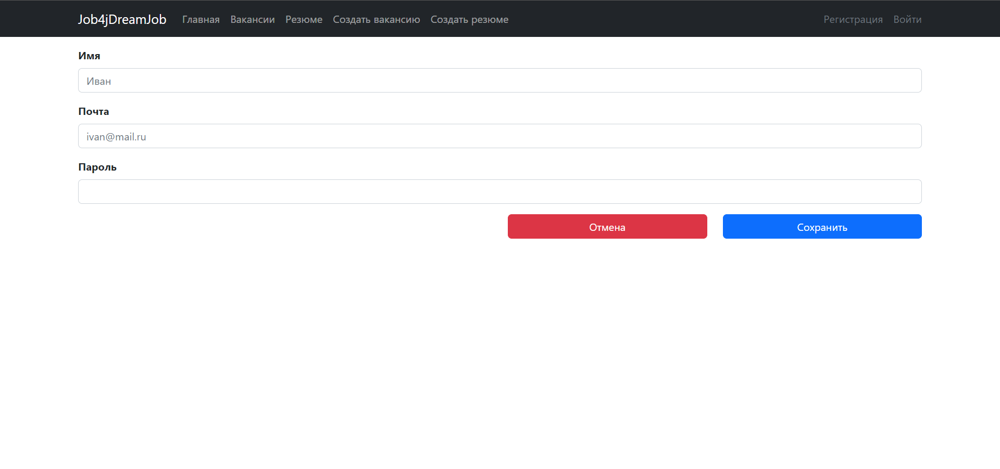
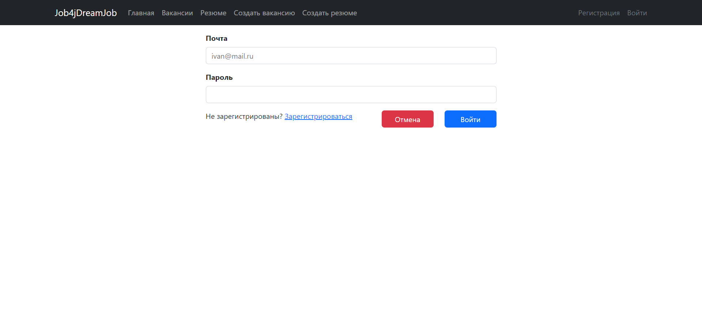
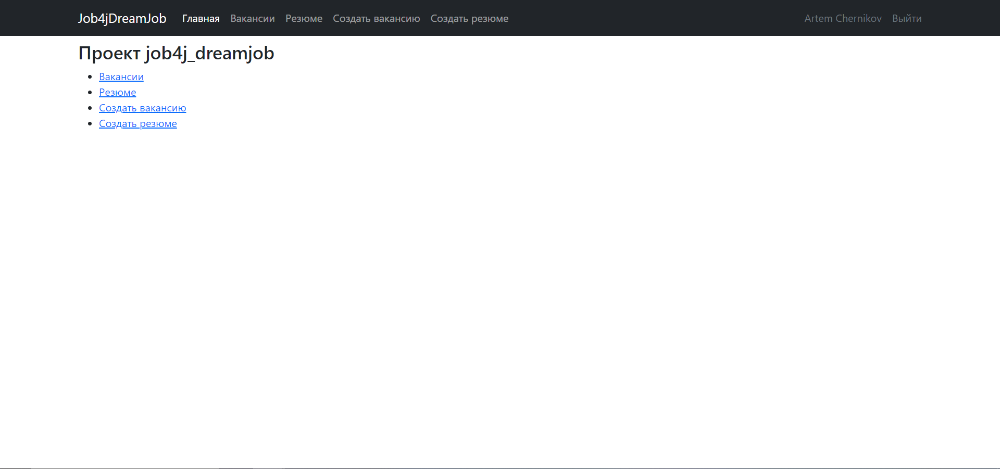
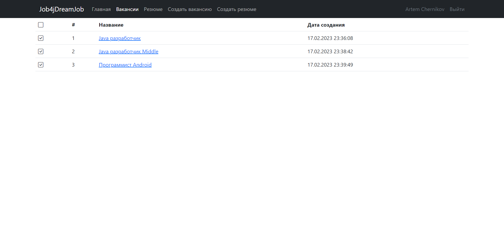
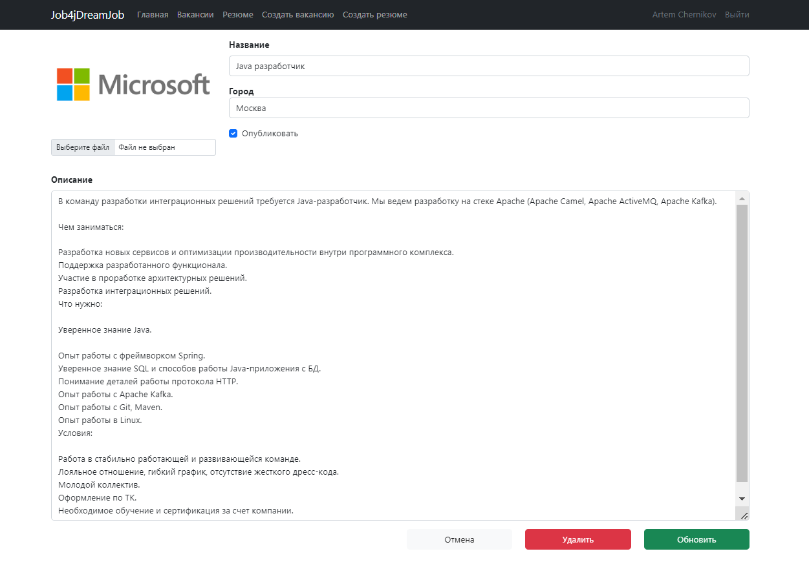
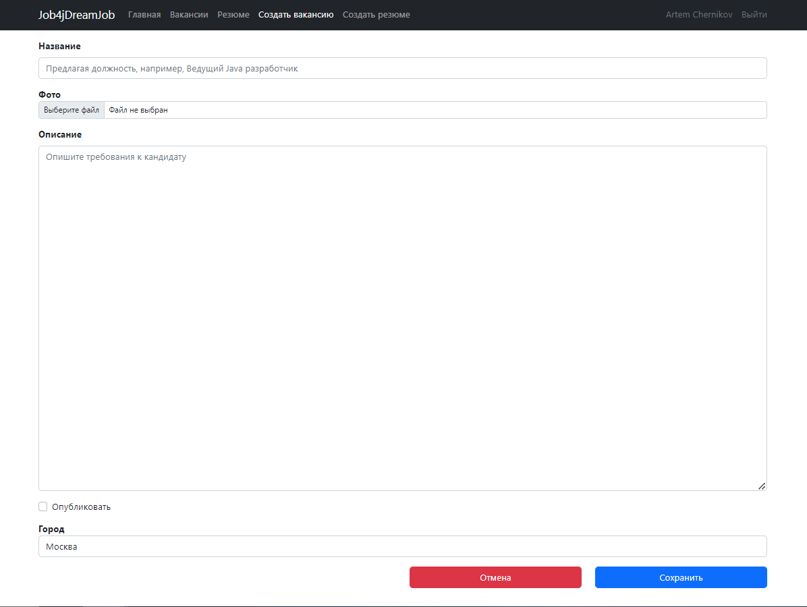
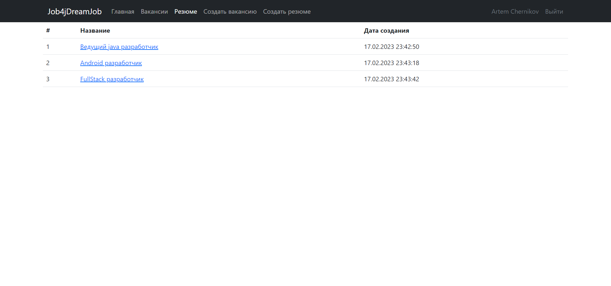
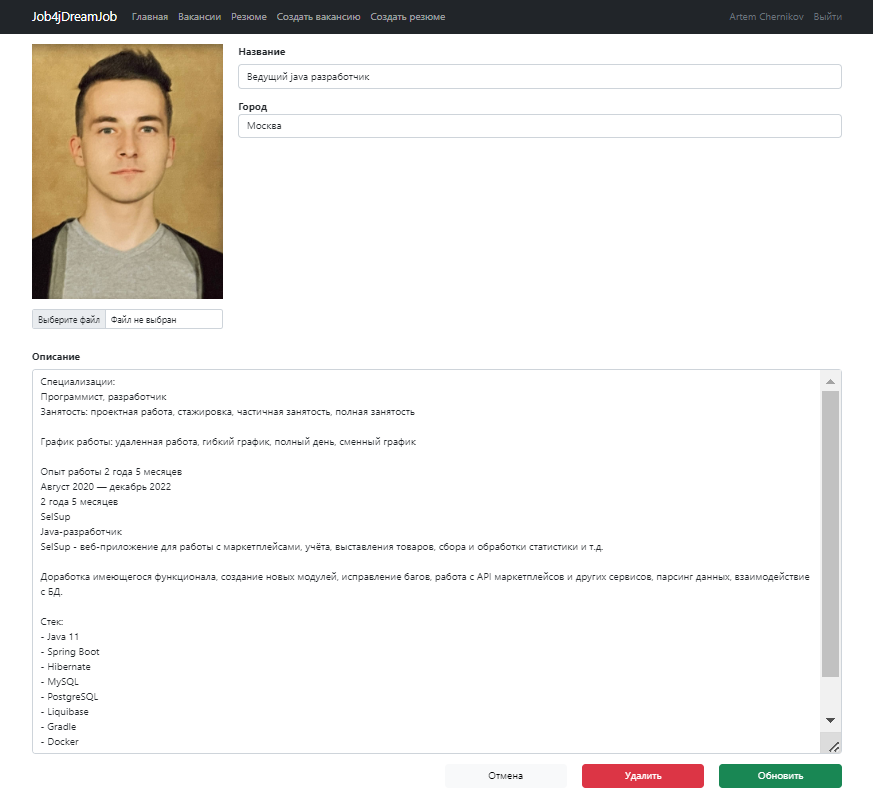
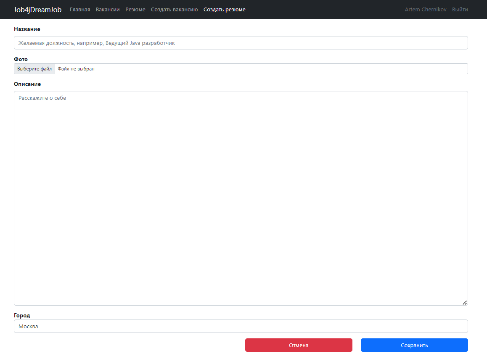

# Работа мечты

## О проекте

**Проект представляет собой web-приложение по по поиску или предложению работы. Сервис состоит из:**

* главной страницы, которая выводит общую информацию о ресурсе;
* страницы со списком доступных вакансий на данный момент;
* страницы со списком резюме кандидатов, которые находятся в поисках работы; 
* страницы возможностью создания новой вакансии;
* страницы с возможностью создания нового резюме;
* страницы регистрации и авторизации пользователя.

## Инструменты

- **Java 17**
- **Spring Boot 2.7.6**
- **PostgreSQL 14**
- **Slf4j**
- **HTML 5**
- **Thymeleaf 2.7.6**
- **Bootstrap 4.4.1**
- **H2database 1.4.2**
- **SQL2o 1.6.0**
- **Commons-dbcp2 2.9.0**
- **Junit 5**
- **Mockito 4.8.0**
- **Liquibase 4.15.0**
- **Maven 3.8**
- **Git**

## Требования к окружению

- **Java 17**
- **Maven 3.8**
- **PostgresSQL 14**

## Сборка и запуск<br>

- **Создать БД**

``` shell 
create database dreamjob;
```

- **Запустить проект по команде**

``` shell 
mvn spring-boot:run -Pproduction
```

- **Перейти в браузере по ссылке**

``` shell 
http://localhost:8080/
```

## Взаимодействие с приложением<br>

### Если пользователь не зарегистрирован в системе, необходимо пройти регистрацию.


### На странице авторизации необходимо выполнить вход.


### На главной странице выведена общая информация о ресурсе.


### На странице с вакансиями можете посмотреть доступные предложения от работодателей.


### Если нажать на название вакансии, вы перейдете к подробному описанию вакансии, также предоставляется возможность редактирования/удаления вакансии.


### Если у работодателя открылась новая вакансия, то ее без проблем можно создать.


### На странице с резюме можете посмотреть кандидатов, которые ищут работу.


### Если нажать на название резюме, вы перейдете к подробному описанию кандидата, также предоставляется возможность редактирования/удаления резюме.


### Если кандидат хочет разместить резюме, то его без проблем можно создать.


## Контакты для связи<br>
<a href="https://t.me/OvercomingJunk" target="blank"></a>

